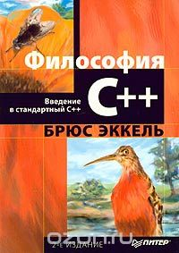
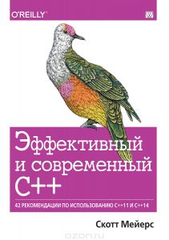
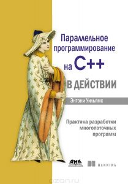

## Лекции

[https://github.com/mtrempoltsev/msu_cpp_lectures](https://github.com/mtrempoltsev/msu_cpp_lectures)

## Рекомендуемая литература

### Начальный уровень



#### Брюс Эккель, Философия С++

Книга старая, но довольно основательная.

### Продвинутый уровень

1. Стивен Дьюхерст, C++. Священные знания
2. Скотт Мейерс, смело можно читать все
3. Герб Саттер, аналогично

### Из относительно свежего




## Препроцессор, компилятор, компоновщик

Процесс трансляции исходного кода в виде текстового файла в представление, которое может быть выполнено процессором - сборка.

Состоит из 3 этапов:
1. Обработка исходного кода препроцессором (preprocessing)
2. Компиляция, то есть перевод подготовленного исходного кода в инструкции процессора (объектный файл) (compiling)
3. Компоновка - сборка одного или нескольких объектных файлов в один исполняемый файл (linking)

```c++
int square(int value)
{
    return value * value;
}
```

```nasm
push   %rbp
mov    %rsp,%rbp
mov    %edi,-0x4(%rbp)
mov    -0x4(%rbp),%eax
imul   -0x4(%rbp),%eax
pop    %rbp
retq   
```

> Удобный инструмент: [https://godbolt.org](https://godbolt.org)

```c++
int main()
{
    return square(2);
}
```

```nasm
push   %rbp
mov    %rsp,%rbp
mov    $0x2,%edi
callq  _Z6squarei
pop    %rbp
retq   
```

#### Декорирование (mangling)

В С++ есть перегрузка функций (а еще есть классы), поэтому у нужен механизм чтобы различать перегруженные функции.

```c++
void print(int value); // _Z5printi
void print(const char* value); // _Z5printPKc
```

Инструмент для обратного преобразования:

```
c++filt _Z5printPKc
```

```
print(char const*)
```

#### extern "C"

```c++
extern "C"
{
    void print(int value); // print
}
```

#### Размещение программы в памяти


> Программа может быть загружена в разное время в разные участки памяти, соответственно адреса функций будут разными.

```
g++ main.cpp
```

Вывод:

```
a.out
```

```
g++ main.cpp -o my_prog 
```

```
objdump -d my_prog
```

```

my_prog:     file format elf64-x86-64


Disassembly of section .init:

0000000000400390 <_init>:
  ...
  
Disassembly of section .plt:

00000000004003b0 <__libc_start_main@plt-0x10>:
  ...
   
00000000004003c0 <__libc_start_main@plt>:
  ...
   
Disassembly of section .plt.got:

00000000004003d0 <.plt.got>:
  ...
   
Disassembly of section .text:
  ...

00000000004003e0 <_start>:
  ...
  
0000000000400410 <deregister_tm_clones>:
  ...
  
0000000000400450 <register_tm_clones>:
  ...
  
0000000000400490 <__do_global_dtors_aux>:
  ...
  
00000000004004b0 <frame_dummy>:
  ...
  
00000000004004d6 <_Z6squarei>:
  4004d6:  55                     push   %rbp
  4004d7:  48 89 e5               mov    %rsp,%rbp
  4004da:  89 7d fc               mov    %edi,-0x4(%rbp)
  4004dd:  8b 45 fc               mov    -0x4(%rbp),%eax
  4004e0:  0f af 45 fc            imul   -0x4(%rbp),%eax
  4004e4:  5d                     pop    %rbp
  4004e5:  c3                     retq   

00000000004004e6 <main>:
  4004e6:  55                     push   %rbp
  4004e7:  48 89 e5               mov    %rsp,%rbp
  4004ea:  bf 02 00 00 00         mov    $0x2,%edi
  4004ef:  e8 e2 ff ff ff         callq  4004d6 <_Z6squarei>
  4004f4:  5d                     pop    %rbp
  4004f5:  c3                     retq   
  4004f6:  66 2e 0f 1f 84 00 00   nopw   %cs:0x0(%rax,%rax,1)
  4004fd:  00 00 00 

0000000000400500 <__libc_csu_init>:
  ...

0000000000400570 <__libc_csu_fini>:
  ...
  
Disassembly of section .fini:

0000000000400574 <_fini>:
  ...
```

Секции - блоки данных в откомпилированном файле. Это может быть:
- Код (.text)
- Статические данные (.data)
- Таблицы строк
- Таблицы символов (.symtab)

Символ - имя функции, плюс ее положение в файле.

##### square.cpp

```
int square(int value)
{
    return value * value;
}
```

Это файл с исходным кодом, он содержит определения функций.

Компилируются cpp/c/etc файлы, один файл с исходным кодом - один объектный файл. **Это называется единица трансляции.**

```
g++ -c square.cpp
```

Вывод:

```
square.o
```

Смотрим таблицу символов:

```
objdump -t square.o
```

Вывод:

```
square.o:     file format elf64-x86-64

SYMBOL TABLE:
0000000000000000 l    df *ABS*  0000000000000000 square.cpp
0000000000000000 l    d  .text  0000000000000000 .text
0000000000000000 l    d  .data  0000000000000000 .data
0000000000000000 l    d  .bss  0000000000000000 .bss
0000000000000000 l    d  .note.GNU-stack  0000000000000000 .note.GNU-stack
0000000000000000 l    d  .eh_frame  0000000000000000 .eh_frame
0000000000000000 l    d  .comment  0000000000000000 .comment
0000000000000000 g     F .text  0000000000000010 _Z6squarei
```

##### square.h

```c++
int square(int value);
```

Это заголовочный файл, как правило в нем находятся объявления типов и функций.

##### main.cpp

```c++
#include "square.h"

int main()
{
    return square(2);
}
```

### Препроцессор

```
g++ -E main.cpp
```

Вывод:

```c++
# 1 "main.cpp"
# 1 "<built-in>"
# 1 "<command-line>"
# 1 "/usr/include/stdc-predef.h" 1 3 4
# 1 "<command-line>" 2
# 1 "main.cpp"
# 1 "square.h" 1
int square(int value);
# 2 "main.cpp" 2

int main()
{
    return square(2);
}
```

Директивы препроцессора:

- ```#include "name"``` - целиком вставляет файл с именем ```name```, вставляемый файл также обрабатывается препроцессором. Поиск файла происходит в директории с файлом из которого происходит включение
- ```#include <name>``` - аналогично предыдущей директиве, но поиск производится глобальных директориях и директориях указанных с помощью ключа ```-I```
- ```#define x y``` - вместо ```y``` подставляет ```x```

### Компиляция

```
g++ -c main.cpp
```

В результате мы имеем 2 файла:
- main.o
- square.o

### Компоновка

```
g++ -o my_prog main.o square.o
```

### Что g++ делает под капотом

```
g++ -o my_prog -v main.cpp square.cpp
```

Вывод:

```
Using built-in specs.
COLLECT_GCC=g++
COLLECT_LTO_WRAPPER=/usr/lib/gcc/x86_64-linux-gnu/5/lto-wrapper
Target: x86_64-linux-gnu
Configured with: ../src/configure -v --with-pkgversion=
    'Ubuntu 5.4.0-6ubuntu1~16.04.4' --with-bugurl=
    file:///usr/share/doc/gcc-5/README.Bugs --enable-languages=
    c,ada,c++,java,go,d,fortran,objc,obj-c++ --prefix=/usr 
    --program-suffix=-5 --enable-shared --enable-linker-build-id 
    --libexecdir=/usr/lib --without-included-gettext 
    --enable-threads=posix --libdir=/usr/lib --enable-nls 
    --with-sysroot=/ --enable-clocale=gnu --enable-libstdcxx-debug
    --enable-libstdcxx-time=yes --with-default-libstdcxx-abi=new
    --enable-gnu-unique-object --disable-vtable-verify
    --enable-libmpx --enable-plugin --with-system-zlib 
    --disable-browser-plugin --enable-java-awt=gtk 
    --enable-gtk-cairo --with-java-home=/usr/lib/jvm/java-1.5.0-
    gcj-5-amd64/jre --enable-java-home --with-jvm-root-dir=/usr/
    lib/jvm/java-1.5.0-gcj-5-amd64 --with-jvm-jar-dir=/usr/lib/
    jvm-exports/java-1.5.0-gcj-5-amd64 --with-arch-directory=amd64 
    --with-ecj-jar=/usr/share/java/eclipse-ecj.jar --enable-objc-gc 
    --enable-multiarch --disable-werror --with-arch-32=i686 
    --with-abi=m64 --with-multilib-list=m32,m64,mx32 
    --enable-multilib --with-tune=generic --enable-checking=release 
    --build=x86_64-linux-gnu --host=x86_64-linux-gnu 
    --target=x86_64-linux-gnu
Thread model: posix
gcc version 5.4.0 20160609 (Ubuntu 5.4.0-6ubuntu1~16.04.4) 
COLLECT_GCC_OPTIONS='-o' 'my_prog' '-v' '-shared-libgcc' 
    '-mtune=generic' '-march=x86-64'
/usr/lib/gcc/x86_64-linux-gnu/5/cc1plus 
    -quiet -v -imultiarch x86_64-linux-gnu 
    -D_GNU_SOURCE main.cpp -quiet -dumpbase main.cpp 
    -mtune=generic -march=x86-64 -auxbase main -version 
    -fstack-protector-strong -Wformat -Wformat-security 
    -o /tmp/ccF33Q8L.s
GNU C++ (Ubuntu 5.4.0-6ubuntu1~16.04.4) version 5.4.0 
    20160609 (x86_64-linux-gnu)
  compiled by GNU C version 5.4.0 20160609, 
    GMP version 6.1.0, MPFR version 3.1.4, MPC version 1.0.3
GGC heuristics: --param ggc-min-expand=100 
    --param ggc-min-heapsize=131072
ignoring duplicate directory "/usr/include/x86_64-linux-gnu/c++/5"
ignoring nonexistent directory "/usr/local/include/x86_64-linux-gnu"
ignoring nonexistent directory "/usr/lib/gcc/x86_64-linux-gnu/5/../../../../x86_64-linux-gnu/include"
#include "..." search starts here:
#include <...> search starts here:
 /usr/include/c++/5
 /usr/include/x86_64-linux-gnu/c++/5
 /usr/include/c++/5/backward
 /usr/lib/gcc/x86_64-linux-gnu/5/include
 /usr/local/include
 /usr/lib/gcc/x86_64-linux-gnu/5/include-fixed
 /usr/include/x86_64-linux-gnu
 /usr/include
End of search list.
GNU C++ (Ubuntu 5.4.0-6ubuntu1~16.04.4) version 5.4.0 
    20160609 (x86_64-linux-gnu)
  compiled by GNU C version 5.4.0 20160609, 
    GMP version 6.1.0, MPFR version 3.1.4, MPC version 1.0.3
GGC heuristics: --param ggc-min-expand=100 
    --param ggc-min-heapsize=131072
Compiler executable checksum: c3fdb80f2154421ceaf9e22c85325a8d
COLLECT_GCC_OPTIONS='-o' 'my_prog' '-v' '-shared-libgcc' 
    '-mtune=generic' '-march=x86-64'as -v --64 -o /tmp/ccyZlmRb.o /tmp/ccF33Q8L.s
GNU assembler version 2.26.1 (x86_64-linux-gnu) using 
    BFD version (GNU Binutils for Ubuntu) 2.26.1
COLLECT_GCC_OPTIONS='-o' 'my_prog' '-v' '-shared-libgcc' 
    '-mtune=generic' '-march=x86-64'
/usr/lib/gcc/x86_64-linux-gnu/5/cc1plus -quiet -v -imultiarch 
    x86_64-linux-gnu -D_GNU_SOURCE square.cpp -quiet -dumpbase 
    square.cpp -mtune=generic -march=x86-64 -auxbase square -version 
    -fstack-protector-strong -Wformat -Wformat-security 
    -o /tmp/ccF33Q8L.s
GNU C++ (Ubuntu 5.4.0-6ubuntu1~16.04.4) version 5.4.0 
    20160609 (x86_64-linux-gnu)
  compiled by GNU C version 5.4.0 20160609, 
    GMP version 6.1.0, MPFR version 3.1.4, MPC version 1.0.3
GGC heuristics: --param ggc-min-expand=100 
    --param ggc-min-heapsize=131072
ignoring duplicate directory "/usr/include/x86_64-linux-gnu/c++/5"
ignoring nonexistent directory "/usr/local/include/x86_64-linux-gnu"
#include "..." search starts here:
#include <...> search starts here:
 /usr/include/c++/5
 /usr/include/x86_64-linux-gnu/c++/5
 /usr/include/c++/5/backward
 /usr/lib/gcc/x86_64-linux-gnu/5/include
 /usr/local/include
 /usr/lib/gcc/x86_64-linux-gnu/5/include-fixed
 /usr/include/x86_64-linux-gnu
 /usr/include
End of search list.
GNU C++ (Ubuntu 5.4.0-6ubuntu1~16.04.4) version 5.4.0 
    20160609 (x86_64-linux-gnu)
  compiled by GNU C version 5.4.0 20160609, 
    GMP version 6.1.0, MPFR version 3.1.4, MPC version 1.0.3
GGC heuristics: --param ggc-min-expand=100 
    --param ggc-min-heapsize=131072
Compiler executable checksum: c3fdb80f2154421ceaf9e22c85325a8d
COLLECT_GCC_OPTIONS='-o' 'my_prog' '-v' '-shared-libgcc' 
    '-mtune=generic' '-march=x86-64' as -v --64 
    -o /tmp/ccofnAFB.o /tmp/ccF33Q8L.s
GNU assembler version 2.26.1 (x86_64-linux-gnu) 
    using BFD version (GNU Binutils for Ubuntu) 2.26.1
COMPILER_PATH=/usr/lib/gcc/x86_64-linux-gnu/5/:
    /usr/lib/gcc/x86_64-linux-gnu/5/:/usr/lib/gcc/x86_64-linux-gnu/:
    /usr/lib/gcc/x86_64-linux-gnu/5/:/usr/lib/gcc/x86_64-linux-gnu/
LIBRARY_PATH=/usr/lib/gcc/x86_64-linux-gnu/5/:
    /usr/lib/gcc/x86_64-linux-gnu/5/../../../x86_64-linux-gnu/:
    /usr/lib/gcc/x86_64-linux-gnu/5/../../../../lib/:
    /lib/x86_64-linux-gnu/:/lib/../lib/:/usr/lib/x86_64-linux-gnu/:
    /usr/lib/../lib/:/usr/lib/gcc/x86_64-linux-gnu/5/../../../:
    /lib/:/usr/lib/
COLLECT_GCC_OPTIONS='-o' 'my_prog' '-v' '-shared-libgcc' 
    '-mtune=generic' '-march=x86-64'
/usr/lib/gcc/x86_64-linux-gnu/5/collect2 -plugin 
    /usr/lib/gcc/x86_64-linux-gnu/5/liblto_plugin.so 
    -plugin-opt=/usr/lib/gcc/x86_64-linux-gnu/5/lto-wrapper 
    -plugin-opt=-fresolution=/tmp/ccQi83u1.res -plugin-opt=-pass-through=-lgcc_s 
    -plugin-opt=-pass-through=-lgcc -plugin-opt=-pass-through=-lc 
    -plugin-opt=-pass-through=-lgcc_s -plugin-opt=-pass-through=-lgcc 
    --sysroot=/ --build-id --eh-frame-hdr -m elf_x86_64 --hash-style=gnu 
    --as-needed -dynamic-linker /lib64/ld-linux-x86-64.so.2 -z relro 
    -o my_prog /usr/lib/gcc/x86_64-linux-gnu/5/../../../x86_64-linux-gnu/crt1.o 
    /usr/lib/gcc/x86_64-linux-gnu/5/../../../x86_64-linux-gnu/crti.o 
    /usr/lib/gcc/x86_64-linux-gnu/5/crtbegin.o -L/usr/lib/gcc/x86_64-linux-gnu/5 
    -L/usr/lib/gcc/x86_64-linux-gnu/5/../../../x86_64-linux-gnu 
    -L/usr/lib/gcc/x86_64-linux-gnu/5/../../../../lib -L/lib/x86_64-linux-gnu 
    -L/lib/../lib -L/usr/lib/x86_64-linux-gnu -L/usr/lib/../lib 
    -L/usr/lib/gcc/x86_64-linux-gnu/5/../../.. /tmp/ccyZlmRb.o /tmp/ccofnAFB.o 
    -lstdc++ -lm -lgcc_s -lgcc -lc -lgcc_s -lgcc 
    /usr/lib/gcc/x86_64-linux-gnu/5/crtend.o 
    /usr/lib/gcc/x86_64-linux-gnu/5/../../../x86_64-linux-gnu/crtn.o

```

### Оптимизация

##### main.cpp

```c++
int square(int value)
{
    return value * value;
}

int main()
{
    return square(2);
}
```

```
g++ -e main.cpp
objdump -d main.o
```

```
0000000000000010 <main>:
  10:  55                     push   %rbp
  11:  48 89 e5               mov    %rsp,%rbp
  14:  bf 02 00 00 00         mov    $0x2,%edi
  19:  e8 00 00 00 00         callq  1e <main+0xe>
  1e:  5d                     pop    %rbp
  1f:  c3                     retq 
```

```
g++ -O2 -e main.cpp
objdump -d main.o
```

```
0000000000000000 <main>:
   0:  b8 04 00 00 00         mov    $0x4,%eax
   5:  c3                     retq 
```