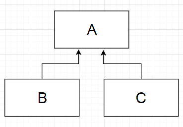
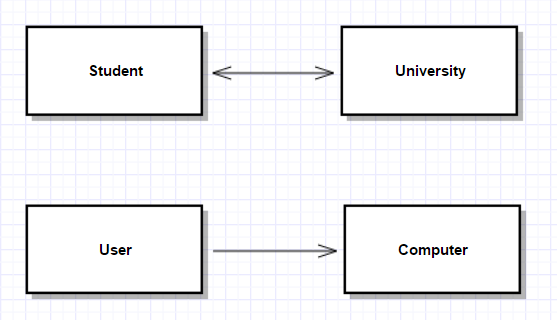
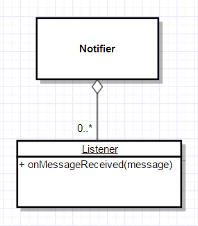
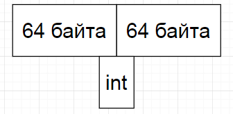

### Структуры и классы

Информация о пользователе:

1. Имя
2. email

```c++
std::string name;
std::string email;
```

##### Агрегируем данные

Для упрощения программы, логически связанные данные можно объеденить.

```c++
struct User
{
    std::string name;
    std::string email;
};

const User user = 
    { "Bob", "bob@mail.ru" };
    
std::cout << user.name;
```

> name, email - поля структуры

##### Много пользователей (array of structs)

```c++
User users[N];
```

##### Много пользователей (struct of arrays)

```c++
struct Users
{
    std::string name[N];
    std::string email[N];
};
```

### Модификаторы доступа

```c++
struct A
{
public:
    int x; // Доступно всем
protected:
    int y; // Наследникам и объектам класса
private:
    int z; // Только объектам класса
};

A a;
a.x = 1; // ок
a.y = 1; // ошибка
a.z = 1; // ошибка
```

> Объект - сущность в адресном пространстве компьютера, появляющаяся
при создании класса.

### struct vs class

В С++ struct от class отличаются только модификатором доступа по-умолчанию. По-умолчанию содержимое struct доступно извне (public), а содержимое class - нет (private).

```c++
class A
{
    int x; // private
};

struct B
{
    int x; // public
}
```

#### Методы класса

```c++
struct User
{
    void serialize(Stream& out)
    {
        out.write(name);
        out.write(email);
    }

private:
    std::string name;
    std::string email;
};
```

> serialize - метод класса

> Методы класса, доступные для использования другими классами представляют его интерфейс

#### Классы в С

```c
struct File
{
    int descriptor;
    char buffer[BufferSize];
};

File* openFile(const char* fileName)
{
    File* file = (File*) malloc(sizeof(File));
    file->descriptor = open(fileName, O_CREAT);
    return file;
}

void write(File* file, const char* data, size_t size)
{
    ...
}

void close(File* file)
{
    close(file->descriptor);
    free(file);
}

File* file = openFile("some_file.dat");
write(file, data, size);
close(file);
```

```c++
class File
{
public:
    File(const char* fileName)
    {
        descriptor = open(fileName, O_CREAT);
    }
    
    void write(const char* data, size_t size)
    {
        ...
    }
    
    ~File()
    {
        close(descriptor);
    }
    
private:
    int descriptor;
    char buffer[BufferSize];
};

File file("some_file.dat");
file.write(data, size);
```

#### Декорирование методов класса

```c++
struct A
{
    void foo(); // _ZN1A3fooEv
};

void bar(); // _Z3barv
```

### Указатель на экземпляр класса

```c++
void write([File* this], const char* data, size_t size)
{
    this->descriptor ...
}
```

> Метод класса - обычная функция, которая неявно получает указатель на объект класса (this)

```c++
struct A
{
    void foo() { std::cout << "ok"; }
    void bar() { std::cout << x; }
    
    int x;
};

A* a = nullptr;
a->foo(); // Ок
a->bar(); // Разыменование нулевого указателя
```

### Конструктор (ctor)

Служит для инициализации объекта.

Если конструктор не написан явно, С++ гарантирует, что будет создан конструктор по умолчанию.

```c++
struct A
{
    A() {}
};
```

##### Конструктор вызывается автоматически при создании объекта

```c++
// Выделение памяти в куче + вызов конструктора
A* x = new A();

// Выделение памяти на стеке + вызов конструктора
A y;
```

### Деструктор (dtor)

Если деструктор не написан явно, С++ гарантирует, что будет создан деструктор по умолчанию.

```c++
struct A
{
    ~A() {}
};
```

Служит для деинициализации объекта, **гарантированно вызыватся при удалении объекта**.

```c++
{
    A* x = new A();
    A y;
} // Выход из области видимости: 
  // вызов деструктора + освобождение 
  // памяти на стеке
  // Для х это означает, что
  // будет освобождена только память
  // занятая указателем, но та,
  // на которую он указывает
```

```c++
{
    A* x = new A();
    A y;
    delete x;
}
```

### RAII (Resource Acquire Is Initialization)

Захват ресурса есть инициализация.

В конструкторе объект получает доступ к какому либо ресурсу (например, открывается файл), а при вызове деструктура этот ресурс освобождается (закрывается файл).

```c++
class File
{
public:
    File(const char* fileName)
    {
        descriptor = open(fileName, O_CREAT);
    }

    ~File()
    {
        close(descriptor);
    }
};
```

> Можно использовать не только для управления ресурсами

```c++
struct Profiler
{
    Profiler() { // получаем текущее время }
    ~Profiler() { // сохраняем время между
        // выховами конструктора и деструктора }
};

void someFunction()
{
    Profiler p;
    if (...) return;
    ...
    if (...) return;
    ...
}
```

### Константные методы

Любые методы кроме конструктора и деструктора могут быть константными.

```c++
class User
{
    using Year = uint32_t;
    Year age;
public:
    void setAge(Year value)
    {
        age = value;
    }

    bool canBuyAlcohol() const
    {
        return age >= 21;
    }
};

class UserDb
{
public:
    const User& getReadOnlyUser(
        const std::string& name) const
    {
        return db.find(name);
    }
};

auto user = userDb.getReadOnlyUser("Bob");
user.setAge(21); // Ошибка
if (user.canBuyAlcohol()) // Ок
```

```c++
void User_setAge([User* const this], Year value)
{
    [this->]age = value;
}

bool User_canBuyAlcohol([const User* const this]) const
{
    return [this->]age >= 21;
}
```

### mutable

```c++
class Log
{
    void write(const std::string& text);
};

class UserDb
{
    mutable Log log;
public:
    const User& getReadOnlyUser(
        const std::string& name) const
    {
        log.write("...");
        return db.find(name);
    }
};
```

```c++
const User& UserDb_getReadOnlyUser(
    [const UserDb* const this],
    const std::string& name) const
{
    [this->]log.write("...");
    // Вызываем Log_write с const Log* const
}

void Log_write([Log* const this], const std::string& text)
{
    ...
}
```

### Наследование

Возможность порождать класс на основе другого с сохранением всех свойств класса-предка.

Класс, от которого производится наследование, называется базовым, родительским или суперклассом. Новый класс – потомком, наследником, дочерним или производным классом.

```c++
class Shape
{
    int x;
    int y;
};

class Circle
    : public Shape
{
    int radius;
};
```

> Наследование моделирует отношение «является».

> Требуется для создания иерархичности – свойства реального мира.

### Представление в памяти при наследовании

#### Инструменты для исследования

- **sizeof(T)** - размер типа в байтах
- **offsetof(T, M)** - смещение поля M от начала типа T

```c++
struct A
{
    double x;
};

struct B
    : public A
{
    double y;
};

struct C
    : public B
{
    double z;
};

std::cout << sizeof(A) << std::endl; // 8
std::cout << sizeof(B) << std::endl; // 16
std::cout << sizeof(C) << std::endl; // 24

std::cout << offsetof(C, x) << std::endl; // 0
std::cout << offsetof(C, y) << std::endl; // 8
std::cout << offsetof(C, z) << std::endl; // 16
```

| Поле | Смещение | Доступность в типах |
|---|---|---|
| x | 0 | A, B, C |
| y | 8 | B, C |
| z | 16 | C |

```c++
C* c = new C();
c->x; // Ок
c->y; // Ок
c->z; // Ок

B* b = (B*) c;
b->x; // Ок
b->y; // Ок
b->z; // Ошибка компиляции

A* a = (A*) c;
a->x; // Ок
a->y; // Ошибка компиляции
a->z; // Ошибка компиляции
```

#### Приведение вверх и вниз по иерархии

##### Приведение вверх (к базовому классу) всегда безопасно.

```c++
void foo(A& a) {}

C c;
foo(c);
```

##### Приведение вниз может быть опасным

```c++
struct A {};
struct B : public A {};
struct C : public A {};
```



```
B* b = new B();
A* a = b;
C* c = a; // Ошибка компиляции
C* c = static_cast<C*>(b); // Ошибка компиляции
C* c = static_cast<C*>(a); // !!!
```

> Сохраняйте тип, пусть компилятор помогает писать корректный код!

> Общий базовый тип - плохая идея

### Композиция

```c++
class Car
{
    Engine engine;
    Wheels wheels[4];
};
```
> Композиция моделирует отношение «содержит/является частью»

### Агрегация

```c++
class Car
{
    Driver* driver_;
};
```

При агрегации класс не контролирует время жизни своей части.

### Унифицированный язык моделирования (Unified Modeling Language, UML)

UML – это открытый стандарт, использующий графические обозначения для создания абстрактной модели системы, называемой UML-моделью. UML используется для визуализации и документирования программных систем. UML не является языком программирования, но на основании UML-моделей возможна генерация кода.

UML редактор: [https://www.draw.io/](https://www.draw.io/)

### Диаграмма классов (Class diagram)

Статическая структурная диаграмма, описывающая структуру системы, демонстрирующая классы системы, их атрибуты, методы и зависимости между классами.

#### Классы

Видимость:

```
+ Публичный метод (public)
# Защищенный метод (protected)
- Приватный метод (private)
```


#### Ассоциация

Показывает, что объекты связаны, бывает однонаправленной и двунаправленной.



#### Композиция

Моделирует отношение «содержит/является частью».

При композиции класс явно контролирует время жизни своей составной части.


#### Агрегация

Моделирует отношение «содержит/является частью».

При агрегации класс не контролирует время жизни своей части.



#### Наследование

Моделирует отношение «является».


### Конструирование объекта

Порядок конструирования:
1. Выделяется память под объект
2. Если есть базовые классы, то конструирование начинается с них в порядке их очередности в списке наследования
3. Инициализируются поля класса в том порядке, в котором они объявлены в классе
4. Происходит вызов конструктора 

```c++
class A
{
public:
    A() {} // 3
    ~A() {}

private:
    int x; // 1
    int y; // 2
};

class B
    : public A
{
public:
    B() {} // 5
    ~B() {}

private:
    int z; // 4
};
```

Порядок уничтожения:
1. Происходит вызов деструктора
2. Вызываются деструкторы для полей класса в обратном порядке их объявления в классе
3. Уничтожаются базовые классы в порядке обратном списку наследования

```c++
class A
{
public:
    A() {}
    ~A() {} // 3

private:
    int x; // 5
    int y; // 4
};

class B
    : public A
{
public:
    B() {}
    ~B() {} // 1

private:
    int z; // 2
};
```

### Списки инициализации

```c++
class A
{
    A()
        : x(5)
        , y(6)
    {
        z = 7;
    }
    
    int x;
    int y;
    int z;
};
```

Распространенная ошибка:

```c++
class A
{
    A()
        : y(5) // Инициализация в порядке объявления в классе!
        , x(y)
    {
    }
    
    int x;
    int y;
};
```

### Инициализация в объявлении

```c++
class A
{
    int x = 3;
};
```

### Выравнивание полей

В целях повышения быстродействия данные в памяти должны быть выровнены, то есть размещены определенным образом.

Предпочтительное выравнивание можно узнать:

```c++
std::cout << alignof(char) << std::endl; // 1
std::cout << alignof(double) << std::endl; // 8
```

##### Гранулярность памяти



#### Инструменты для исследования

- **sizeof(T)** - размер типа в байтах
- **offsetof(T, M)** - смещение поля M от начала типа T

```c++
struct S
{
    char m1;
    double m2;
};
```

```c++
sizeof(char) == 1
sizeof(double) == 8
sizeof(S) == 16
offsetof(S, m1) == 0
offsetof(S, m2) == 8
```

```
[         char         ][        double        ]
[c][.][.][.][.][.][.][.][d][d][d][d][d][d][d][d]
```

Выравниванием можно управлять:
```c++
#pragma pack(push, 1)
class S
{
public:
    char m1;
    double m2;
};
#pragma pack(pop)

offsetof(S, m1) == 0
offsetof(S, m2) == 1
sizeof(S) == 9
```
> Работать будет не всегда, компилятор может это проигнорировать, если посчитает, что сделать это нельзя

### Предсказуемое размещение в памяти

Порядок размещения полей класса/структуры в памяти в порядке объявления гарантирован только для простых типов (POD).

### Простые типы (POD, Plain Old Data)

1. Скалярные типы (bool, числа, указатели, перечисления (enum), nullptr_t)
2. class или struct которые:
    - Имеют только тривиальные (сгенерированные компилятором) конструктор, деструктор, конструктор копирования
    - Нет виртуальных функций и базового класса
    - Все нестатические поля с модификатором доступа public
    - Не содержит статических полей не POD типа

### Примеры

```c++
class NotPOD
{
public:
    NotPOD(int x)
    {
    }
};
```

```c++
class NotPOD
    : public Base
{
};
```

```c++
class NotPOD
{
    virtual void f()
    {
    }
};
```

```c++
class NotPOD
{
    int x;
};
```

```c++
class POD
{
public:
    NotPOD m1;
    int m2;
    static double m3;
private:
    void f() {}
};
```

> Копирование простого типа - memcpy

> Простые типы можно использовать для передачи из программы в программу, записи на диск и т.д. Но только на одной и той-же платформе!

```c++
struct POD
{
    int x;
    double y;
    
    void serialize(File& file) const
    {
        file.write(this, sizeof(POD));
    }
};
```

### Инициализация POD типов

```c++
struct POD
{
    int x;
    double y;
};
```

Инициализация нулем (zero-initialization):

```c++
POD p1 = POD();
POD p2 {};
POD* p3 = new POD();

// x == 0
// y == 0
```

Инициализация по умолчанию (default-initialization):

```c++
POD p1;
POD* p2 = new POD;

// x, y содержат мусор
```

#### Рекомендуемое разделение на заголовочные файлы и файлы с реализацией

##### a.h

```c++
#pragma once

struct A
{
    void foo();
};
```

##### a.cpp

```c++
#include "a.h"

void A::foo()
{
}
```

#### Защита от повторного включения

##### buffer.h

```c++
class Buffer
{
    ...
};
```

##### text_processor.h

```c++
#include "buffer.h"
...
```

##### main.cpp

```c++
#include "buffer.h"
#include "text_processor.h"
```

В одной единице трансляции два объявления класса ```Buffer```, компилятор не знает какое использовать.

##### buffer.h

```c++
#ifndef BUFFER_H
#define BUFFER_H

class Buffer
{
    ...
};

#endif
```

> Или просто ```#pragma once```

#### Циклическое включение

##### a.h

```c++
#include "b.h"

class A
{
    B* b;
};
```

##### b.h

```c++
#include "a.h"

class B
{
    A* a;
};
```

#### Предварительное объявление (forward declarations)

##### a.h

```c++
class B;

class A
{
    B* b;
};
```

##### a.cpp

```c++
#include "b.h"
#include "a.h"

...
```

##### b.h

```c++
class A;

class B
{
    A* a;
};
```

### Практическая часть

Используя метод рекурсивного спуска написать калькулятор. Поддерживаемые операции:
- умножение
- деление
- сложение
- вычитание
- унарный минус

Для вычислений использовать тип int64_t, приоритет операций стандартный. Передача выражения осуществляется через аргумент командной строки, поступаемые числа целые, результат выводится в cout. Пример:

```
calc "2 + 3 * 4 - -2"
```

Вывод:

```
16
```

Должна быть обработка ошибок, в случае некорректного выражения выводить в консоль ```error```

EOF